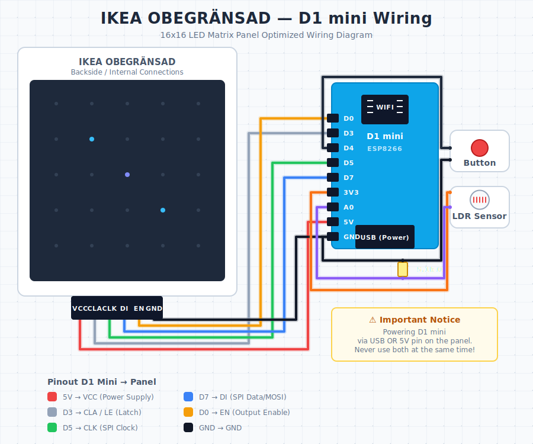
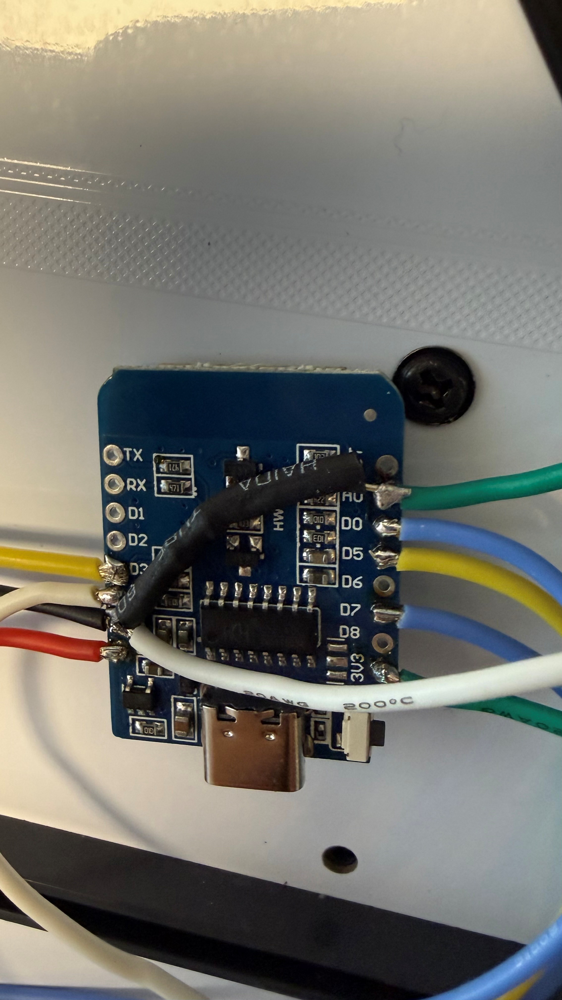
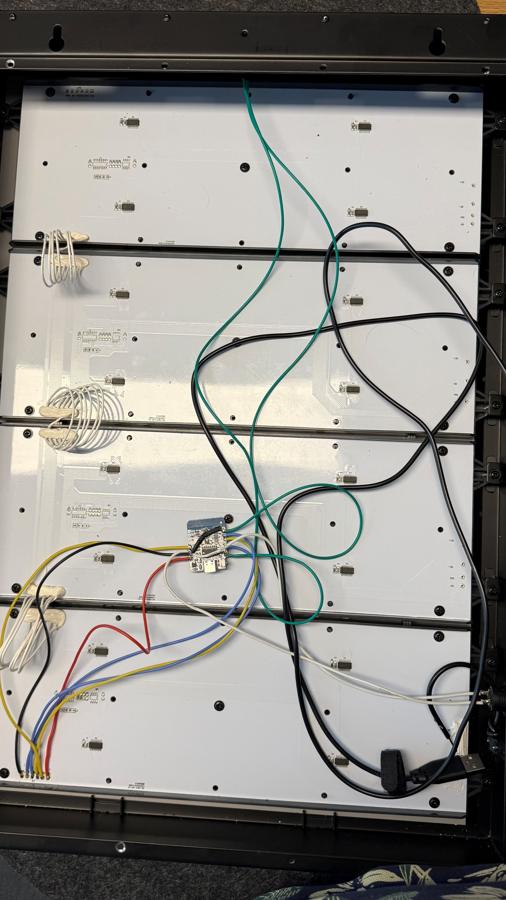

# IKEA OBEGRÄNSAD — Smart LED Matrix Firmware

Custom firmware for the **IKEA OBEGRÄNSAD** 16×16 LED matrix lamp, running on a **Wemos D1 mini (ESP8266)**. Adds animated effects, a web UI, NTP clock, auto-brightness, MQTT control, OTA updates, and a Home Assistant integration.

> Inspired by [ph1p/ikea-led-obegraensad](https://github.com/ph1p/ikea-led-obegraensad) — but rebuilt around the ESP8266/D1 mini with a different effects engine, MQTT command channel, and HA integration.

---

## Table of Contents

1. [Features](#features)
2. [Hardware & Components](#hardware--components)
3. [Wiring](#wiring)
4. [Opening the Lamp](#opening-the-lamp)
5. [First-Time Setup](#first-time-setup)
6. [Web Interface](#web-interface)
7. [Auto-Brightness (LDR)](#auto-brightness-ldr)
8. [MQTT Control](#mqtt-control)
9. [OTA Updates](#ota-updates)
10. [Backup & Restore](#backup--restore)
11. [API Reference](#api-reference)
12. [Home Assistant](#home-assistant)
13. [Troubleshooting](#troubleshooting)

---

## Features

- **13 effects:** Snake, Clock, Rain, Bounce, Stars, Lines, Pulse, Waves, Spiral, Fire, Plasma, Ripple, Sand Clock
- **NTP clock** with configurable timezone (default Europe/Berlin incl. DST), 12/24 h
- **Web UI** with live status, effect picker, brightness slider, full configuration
- **Auto-brightness** via LDR with Exponential Moving Average (no flicker from TV/monitor changes)
- **MQTT control** through a generic `cmd` / `state` topic schema (no built-in presence logic)
- **OTA updates** via ArduinoOTA
- **Backup & restore** of the full configuration as JSON
- **mDNS discovery** (`IkeaClock-<chip>.local`) — auto-discoverable by Home Assistant
- **Hardware button** for cycling effects without the app
- **EEPROM persistence** with versioning & checksum validation
- **API rate-limiting** (20 req / 10 s) against accidental flooding
- **Conditional auto-restart** at 2 AM if heap < 10 KB or uptime > 7 days

---

## Hardware & Components

| Part | Purpose |
|------|---------|
| IKEA OBEGRÄNSAD lamp | 16×16 LED matrix (4 sub-panels of 64 LEDs) |
| Wemos D1 mini (ESP8266) | Controller |
| 5 V power supply, ≥ 1 A | Drives the panel and the D1 mini |
| LDR + ~10 kΩ resistor | Auto-brightness sensor (optional) |
| Push button | Effect cycling (optional) |
| Some hookup wire | 6 wires from D1 mini to panel header |

> The original IKEA lamp uses **rivets** instead of screws — see [Opening the Lamp](#opening-the-lamp).

---

## Wiring

The panel exposes a 6-pin header on its lowest internal sub-board: **VCC, CLA, CLK, DI, EN, GND**.

### Pin Mapping

| D1 mini | GPIO | Panel | Function |
|---------|------|-------|----------|
| **5V**  | —    | VCC   | +5 V power |
| **GND** | —    | GND   | Ground |
| **D0**  | 16   | EN    | Output Enable (PWM brightness) |
| **D3**  |  0   | CLA   | Latch |
| **D5**  | 14   | CLK   | SPI Clock |
| **D7**  | 13   | DI    | SPI Data (MOSI) |
| **D4**  |  2   | —     | Button to GND (optional) |
| **A0**  | —    | —     | LDR to 5 V via voltage divider (optional) |

### Schematic



### Real Wiring

D1 mini soldered to the panel's header — close-up:




Panel header pinout:


> ⚠️ **Power:** Either power the D1 mini through USB **or** through its `5V` pin from the panel supply — never both at once, otherwise USB power can flow back into the panel supply.

---

## Opening the Lamp

The IKEA OBEGRÄNSAD is held together by **rivets**, not screws. Two ways in:

1. **Reversible:** Carefully pry the back panel off by inserting a flat screwdriver between the rivets and the back, then leveraging with a second tool. Slow and steady.
2. **Permanent:** Drill out the rivets. Cleaner access but no going back to factory state.

Inside you'll find 4 sub-panels, daisy-chained. The lowest one carries the 6-pin header you'll wire the D1 mini to.

---

## First-Time Setup

### 1. Clone
```bash
git clone https://github.com/<your-fork>/IkeaObegraensad.git
```

### 2. Create credentials file
```bash
cp secrets_template.h secrets.h
```
Edit `secrets.h`:
```cpp
const char* ssid        = "YOUR_WIFI";
const char* password    = "YOUR_PASSWORD";
const char* otaPassword = "A_STRONG_PASSWORD";
```

### 3. Configure Arduino IDE
- **Board:** *LOLIN(WEMOS) D1 R2 & mini*
- **Flash Size:** at least **1 MB FS (SPIFFS)** — required for logging & backup
- **Upload Speed:** 921600

### 4. Install libraries
- ESP8266WiFi *(board package)*
- ESP8266WebServer *(board package)*
- PubSubClient *(MQTT)*
- ArduinoOTA *(board package)*

### 5. Flash via USB
First install must be over USB. After that you can use OTA.

### 6. Find the device
After boot, the serial monitor (115200 baud) prints:
```
Connected! IP: 192.168.1.42
mDNS hostname: IkeaClock-a1b2c3.local
```
Open that IP in a browser. Done.

---

## Web Interface

Reachable at `http://<ip>` or `http://IkeaClock-<chip>.local`. It provides:

- **Live status:** time, current effect, brightness, MQTT state, display state
- **Effect picker** dropdown
- **Brightness** slider (manual or auto)
- **Timezone** picker (default Europe/Berlin with automatic DST)
- **12 / 24 h format** toggle
- **MQTT configuration** (broker, user, base topic)
- **Auto-brightness** calibration
- **Backup / restore** of the full configuration
- **Restart diagnostics** (reset counter, last reset reason, heap before crash)

---

## Auto-Brightness (LDR)

If an LDR is wired to A0, the display can adapt to ambient light automatically.

**How it works:**
- Sensor is sampled non-blocking (5 samples × 10 ms)
- Values are smoothed with an **Exponential Moving Average** so a passing TV/monitor change won't make it flicker
- Linear mapping from sensor range to brightness range
- Hysteresis prevents constant tiny adjustments

**Calibration parameters (web UI):**

| Parameter   | Meaning |
|-------------|---------|
| `min`       | Minimum display brightness (e.g. at night) |
| `max`       | Maximum display brightness (e.g. midday) |
| `sensorMin` | LDR reading in darkness |
| `sensorMax` | LDR reading in bright light |

---

## MQTT Control

The firmware exposes a **generic MQTT control & state channel** — there is **no built-in presence logic**. If you want presence-driven behavior, map it externally (Home Assistant, Node-RED, …) onto the command topic below.

### Configuration

In the web UI under "MQTT Control":
- **Broker IP** + **Port** (default 1883)
- **User / password** (optional)
- **Base topic** (default `ikeaclock`)

### Command topic — `<baseTopic>/cmd`

Send `key:value` payloads:

| Payload                | Action                                  |
|------------------------|-----------------------------------------|
| `display:on`           | Turn the display on                     |
| `display:off`          | Turn the display off                    |
| `effect:clock`         | Switch effect (any name from the list)  |
| `brightness:512`       | Set brightness 0–1023 (disables auto)   |
| `autobrightness:on`    | Enable auto-brightness                  |
| `autobrightness:off`   | Disable auto-brightness                 |

### State topic — `<baseTopic>/state`

On every change the firmware publishes a retained JSON message:
```json
{"display":true,"effect":"clock","brightness":512,"autoBrightness":false}
```

### Example — Aqara FP2 → display, via Home Assistant

```yaml
automation:
  - alias: "FP2 presence -> IKEA Clock"
    trigger:
      - platform: state
        entity_id: binary_sensor.aqara_fp2_presence
    action:
      - service: mqtt.publish
        data:
          topic: ikeaclock/cmd
          payload: "display:{{ 'on' if trigger.to_state.state == 'on' else 'off' }}"
```

### CLI test
```bash
mosquitto_pub -h 192.168.1.10 -t ikeaclock/cmd -m "effect:fire"
mosquitto_sub -h 192.168.1.10 -t ikeaclock/state
```

---

## OTA Updates

After the first USB install, all subsequent uploads are wireless:

1. **Arduino IDE** → Tools → Port → **Network Ports**
2. Select `IkeaClock-<chip>.local` or the IP address
3. Click Upload
4. Enter the OTA password (from `secrets.h`)

> ⚠️ The display turns off automatically during the update and comes back after the reboot.

---

## Backup & Restore

**Backup:**
```bash
curl http://<ip>/api/backup -o ikeaclock-backup.json
```
Contains all settings: brightness, auto-brightness, MQTT, NTP servers, timezone.

**Restore:**
```bash
curl -X POST http://<ip>/api/restore -d @ikeaclock-backup.json
```

---

## API Reference

All endpoints are rate-limited (20 requests / 10 s).

| Method | Path | Description |
|--------|------|-------------|
| GET  | `/` | Web interface |
| GET  | `/api/status` | Full status (JSON) |
| GET  | `/api/setTimezone?tz=Europe/Berlin` | Set timezone (POSIX TZ string) |
| GET  | `/api/setClockFormat?format=24` | `12` or `24` |
| GET  | `/api/setBrightness?b=0..1023` | Set brightness |
| GET  | `/api/setAutoBrightness?enabled=&min=&max=&sensorMin=&sensorMax=` | Configure auto-brightness |
| GET  | `/api/setMqtt?enabled=&server=&port=&user=&password=&topic=` | Configure MQTT (`topic` = base topic) |
| GET  | `/api/setDisplay?enabled=true\|false` | Display on/off |
| GET  | `/api/backup` | Export configuration as JSON |
| POST | `/api/restore` | Import configuration from JSON |
| GET  | `/api/resetRestartCount` | Reset restart counter |
| GET  | `/effect/<name>` | Switch effect (`snake`, `clock`, `rain`, `bounce`, `stars`, `lines`, `pulse`, `waves`, `spiral`, `fire`, `plasma`, `ripple`, `sandclock`) |
| GET  | `/api/debuglog` | Debug log (NDJSON, only when enabled) |

---

## Home Assistant

A separate **HACS integration** ships every feature without needing MQTT, using plain HTTP polling and mDNS auto-discovery:

➡️ [`ikea-obegraensad-homeassistant`](https://github.com/Abrechen2/ikea-obegraensad-homeassistant)

It exposes switches, selects, lights, and sensors that auto-group under one device.

---

## Troubleshooting

### Build / Flash
- **Watchdog resets during boot** → check Flash Size in the Arduino IDE (must be at least 1 MB FS)
- **OTA can't find the device** → is Avahi/Bonjour running on your machine? Try the IP directly instead of `.local`

### Runtime
- **Display flickers** → re-tune `sensorMin` / `sensorMax` for auto-brightness
- **MQTT won't connect** → verify IP/port, broker reachability, and check the status badge in the web UI
- **Wrong time** → set the timezone as a POSIX TZ string, e.g. `CET-1CEST-2,M3.5.0/02,M10.5.0/03`

### Enable debug logging
In `IkeaObegraensad.ino`:
```cpp
#define DEBUG_LOGGING_ENABLED
```
Logs are written to SPIFFS and can be downloaded from `/api/debuglog` (NDJSON).

---

## Credits

- Original concept and reverse engineering of the OBEGRÄNSAD panel: [ph1p/ikea-led-obegraensad](https://github.com/ph1p/ikea-led-obegraensad)
- This fork: ESP8266/D1 mini port with custom effects, MQTT command channel, and Home Assistant integration

## License

MIT — see [LICENSE](LICENSE).
